# Summary of 3_Linear

[<< Go back](../README.md)

## Logistic Regression (Linear)
- **n_jobs**: -1
- **explain_level**: 2

## Validation
 - **validation_type**: split
 - **train_ratio**: 0.75
 - **shuffle**: True
 - **stratify**: True

## Optimized metric
logloss

## Training time

3.5 seconds

## Metric details
|           |    score |    threshold |
|:----------|---------:|-------------:|
| logloss   | 1.45158  | nan          |
| auc       | 0.466667 | nan          |
| f1        | 0.533333 |   0.0354484  |
| accuracy  | 0.642857 |   0.867166   |
| precision | 0.5      |   0.867166   |
| recall    | 1        |   0.00225237 |
| mcc       | 0.141421 |   0.0354484  |

## Metric details with threshold from accuracy metric
|           |    score |   threshold |
|:----------|---------:|------------:|
| logloss   | 1.45158  |  nan        |
| auc       | 0.466667 |  nan        |
| f1        | 0.285714 |    0.867166 |
| accuracy  | 0.642857 |    0.867166 |
| precision | 0.5      |    0.867166 |
| recall    | 0.2      |    0.867166 |
| mcc       | 0.121716 |    0.867166 |

## Confusion matrix (at threshold=0.867166)
|              |   Predicted as 0 |   Predicted as 1 |
|:-------------|-----------------:|-----------------:|
| Labeled as 0 |                8 |                1 |
| Labeled as 1 |                4 |                1 |

## Learning curves
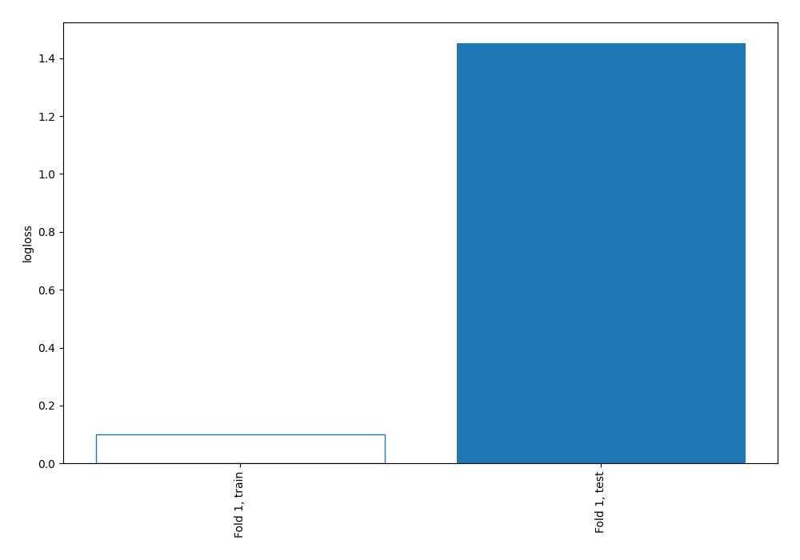

## Coefficients
| feature   |   Learner_1 |
|:----------|------------:|
| Q23       |  0.976663   |
| Q7        |  0.74734    |
| Q33       |  0.742918   |
| Q10_2     |  0.732579   |
| Q15       |  0.637441   |
| Q40_1     |  0.535142   |
| Q30       |  0.502385   |
| Q32       |  0.444902   |
| Q25       |  0.389929   |
| Q3        |  0.340276   |
| Q22       |  0.29204    |
| Q10_1     |  0.276323   |
| Q6        |  0.183553   |
| Q9        |  0.16973    |
| Q1.1      |  0.142335   |
| Q36       |  0.114127   |
| Q40_2     |  0.111141   |
| Q28       |  0.0948538  |
| Q8        |  0.0494845  |
| Q20       |  0.029634   |
| Q19       |  0.0270623  |
| Q4        |  0.019808   |
| Q10_3     |  0.00353277 |
| Q18       | -0.0227333  |
| Q34       | -0.0323692  |
| Q11       | -0.0677168  |
| Q35       | -0.0753504  |
| Q1        | -0.0867719  |
| Q27       | -0.121918   |
| Q_40_3    | -0.132504   |
| Q14       | -0.13825    |
| Q5        | -0.150052   |
| Q24       | -0.153082   |
| Q21       | -0.263028   |
| Q31       | -0.269861   |
| Q16       | -0.34809    |
| Q29       | -0.479315   |
| Q26       | -0.597044   |
| intercept | -0.780512   |
| Q44       | -1.25194    |

## Permutation-based Importance
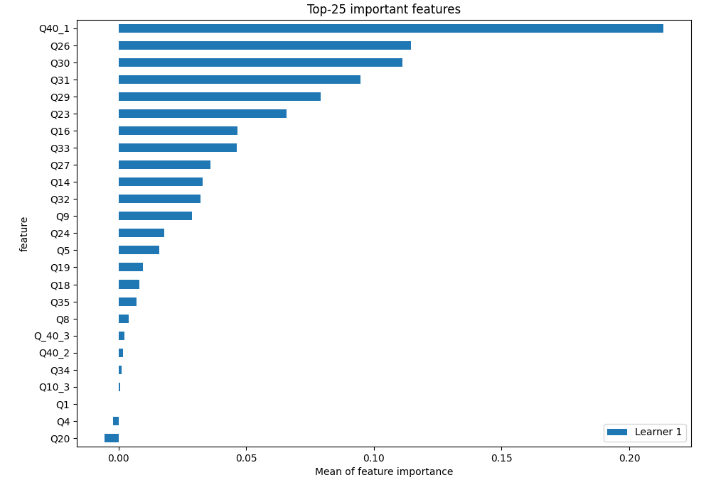
## Confusion Matrix

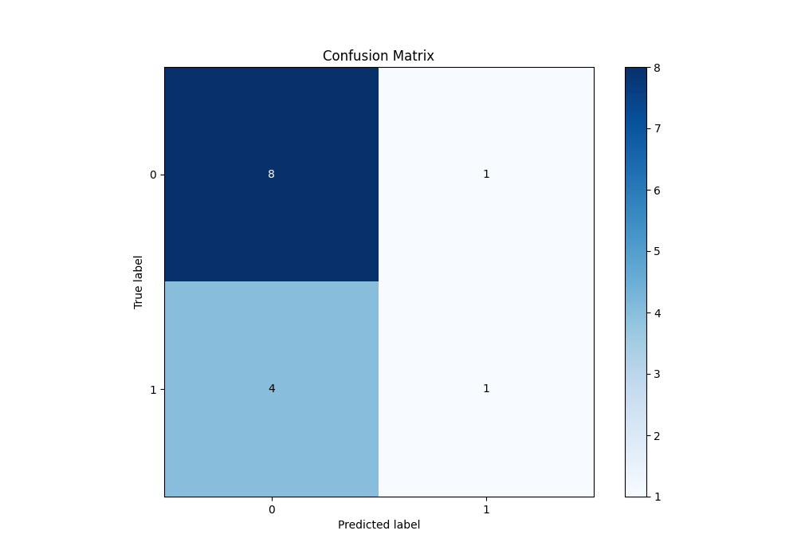

## Normalized Confusion Matrix

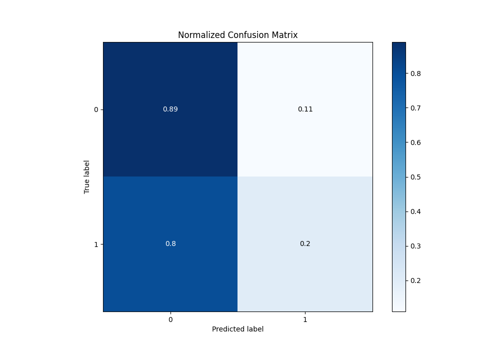

## ROC Curve

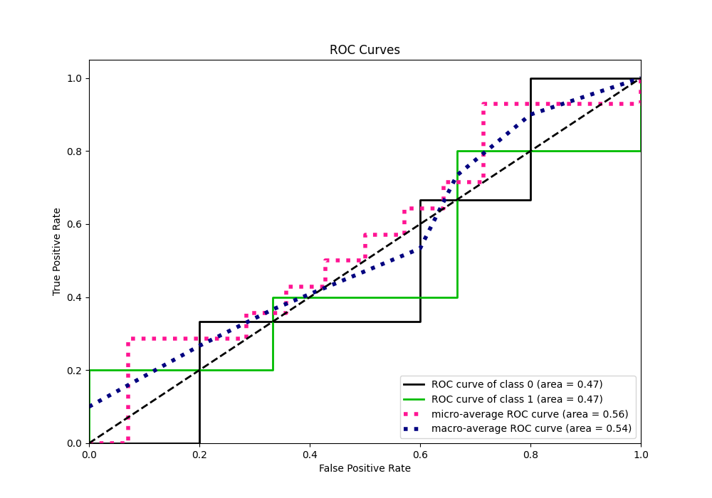

## Kolmogorov-Smirnov Statistic

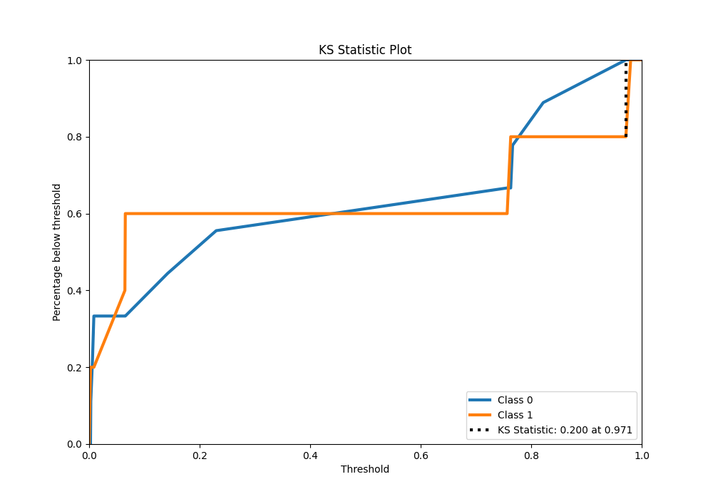

## Precision-Recall Curve

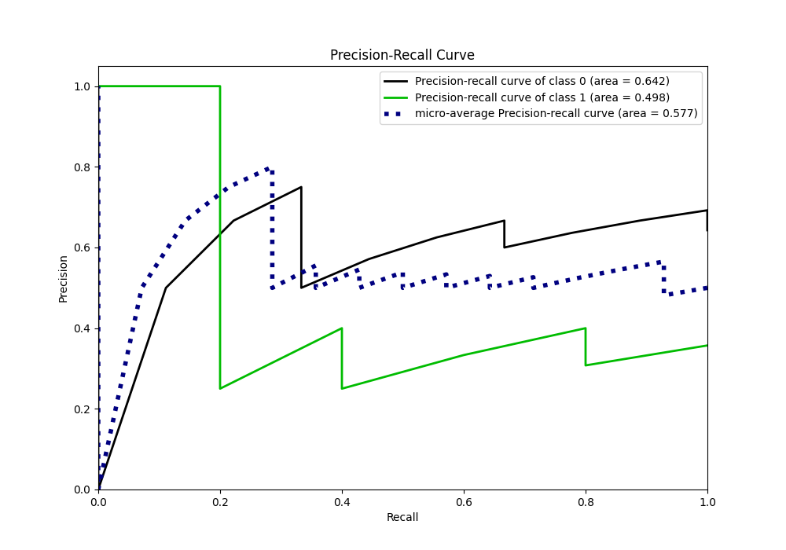

## Calibration Curve

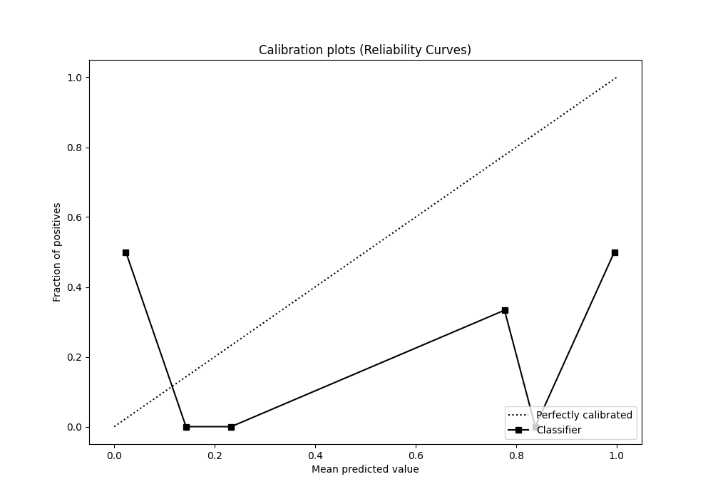

## Cumulative Gains Curve

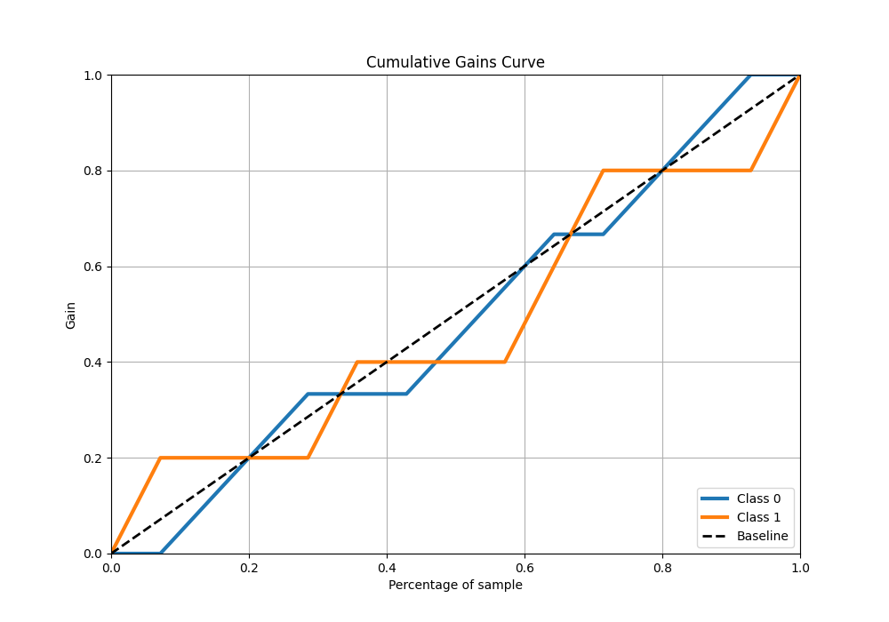

## Lift Curve

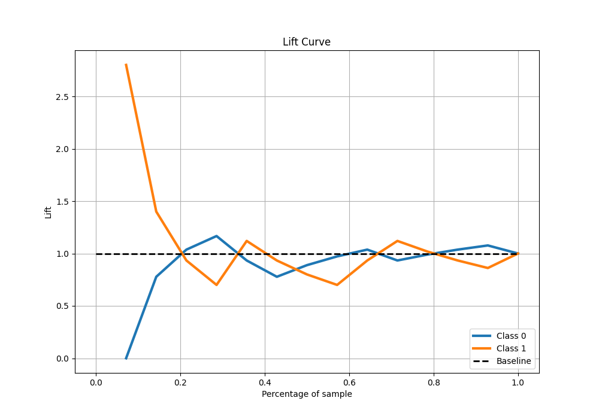

## SHAP Importance
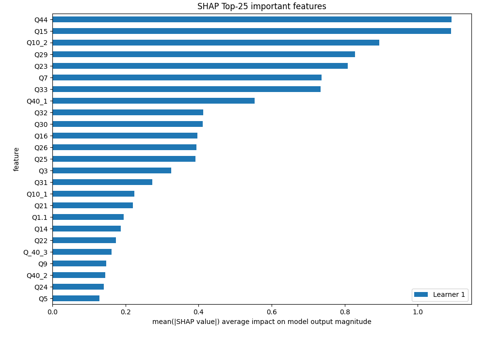

## SHAP Dependence plots

### Dependence (Fold 1)
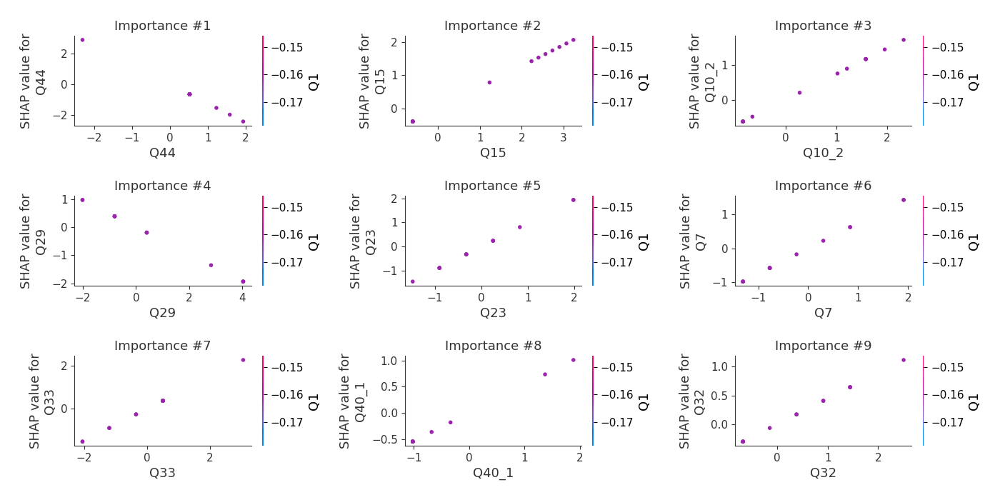

## SHAP Decision plots

### Top-10 Worst decisions for class 0 (Fold 1)
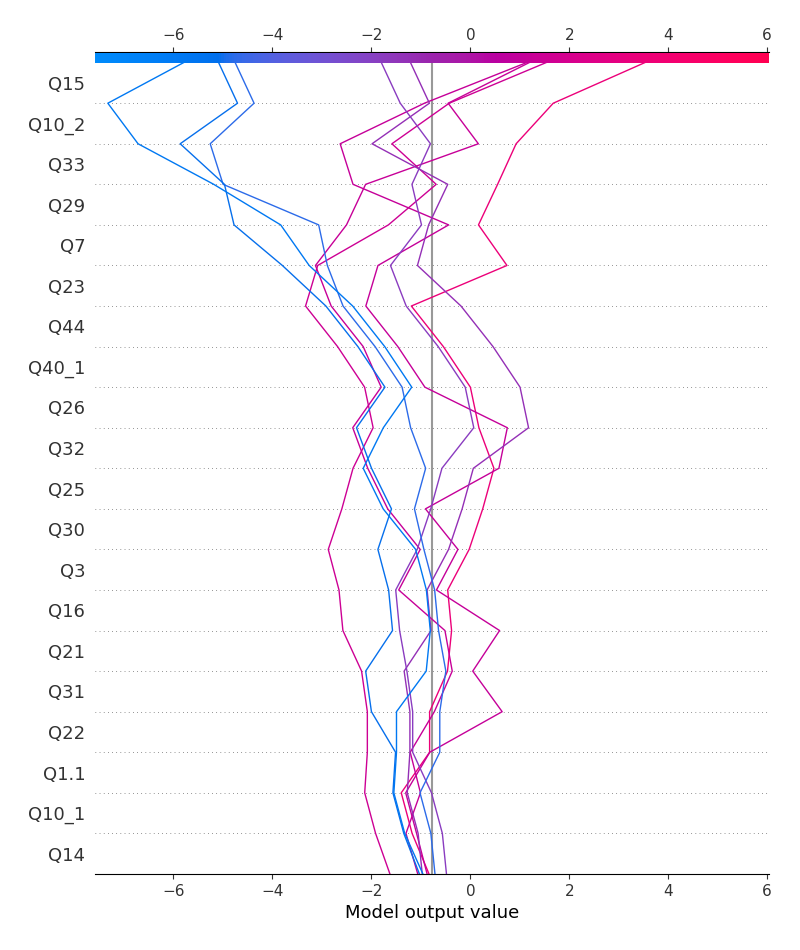
### Top-10 Best decisions for class 0 (Fold 1)

### Top-10 Worst decisions for class 1 (Fold 1)
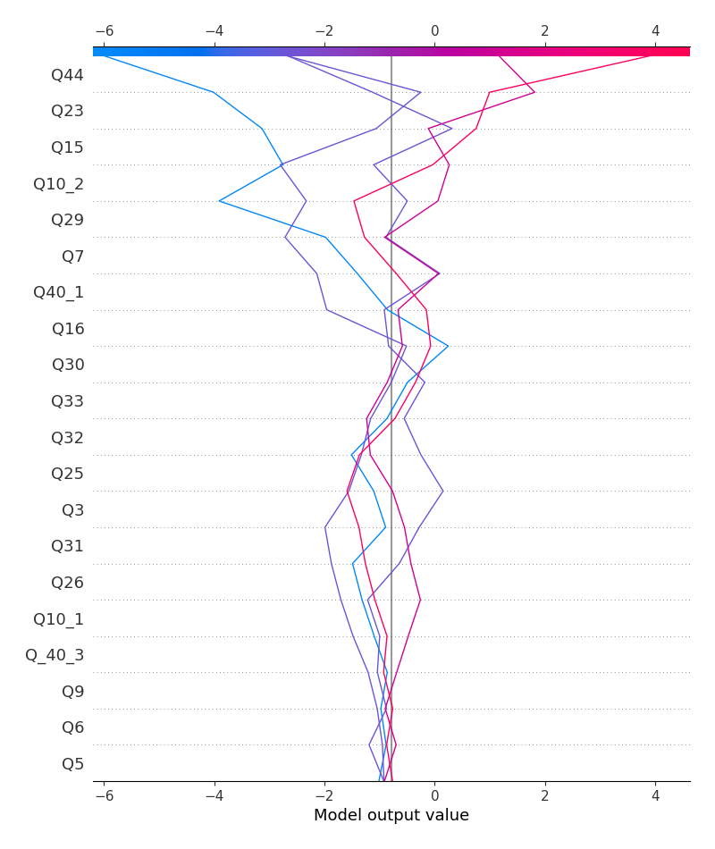
### Top-10 Best decisions for class 1 (Fold 1)

[<< Go back](../README.md)
