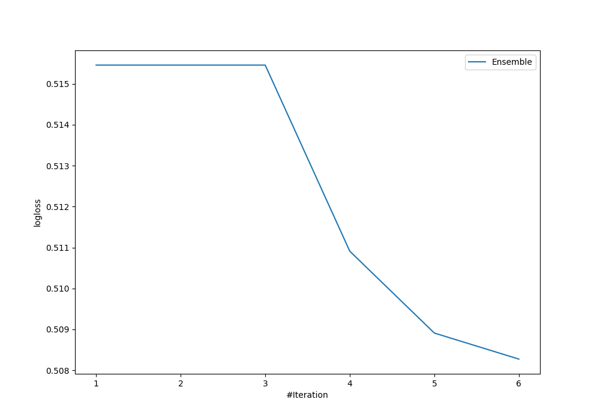
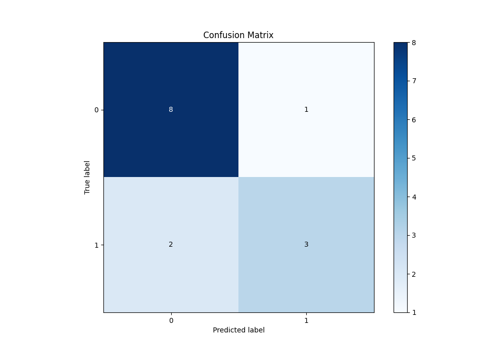
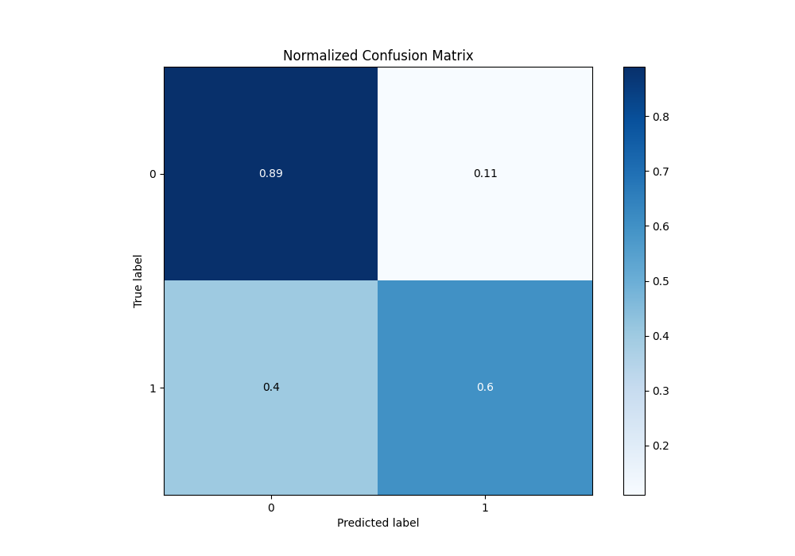
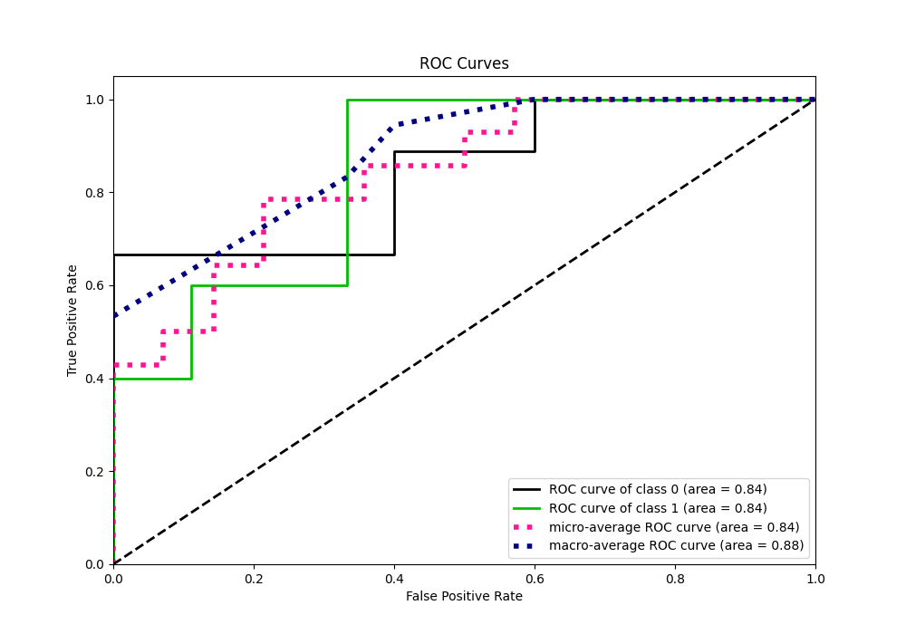
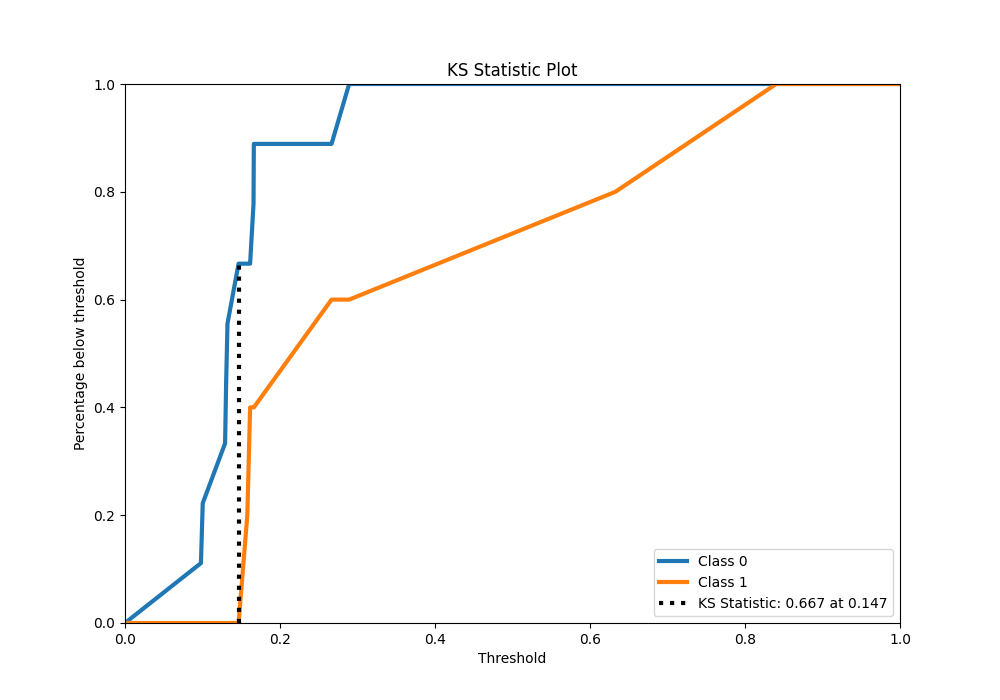
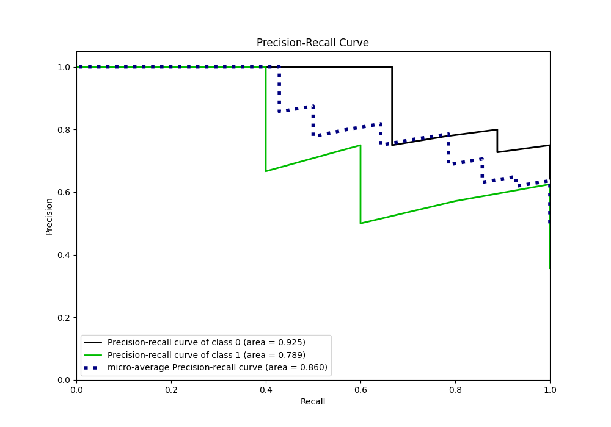
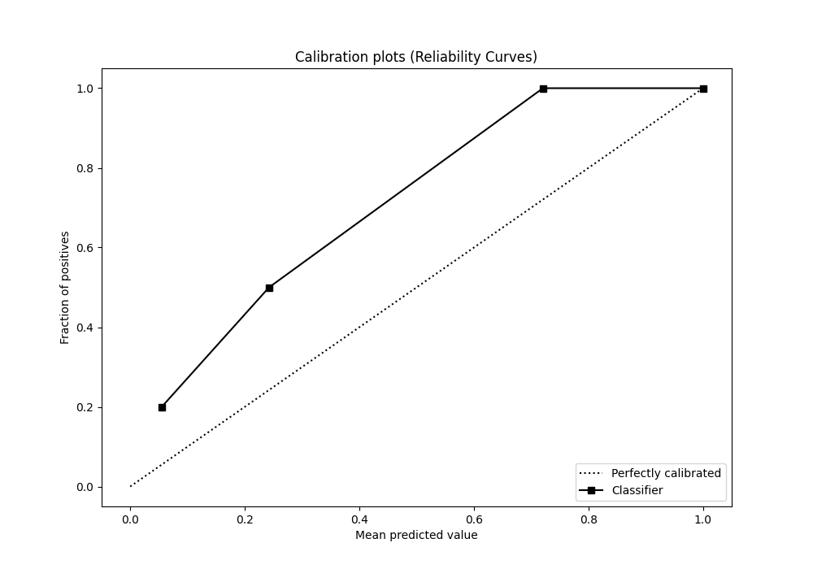
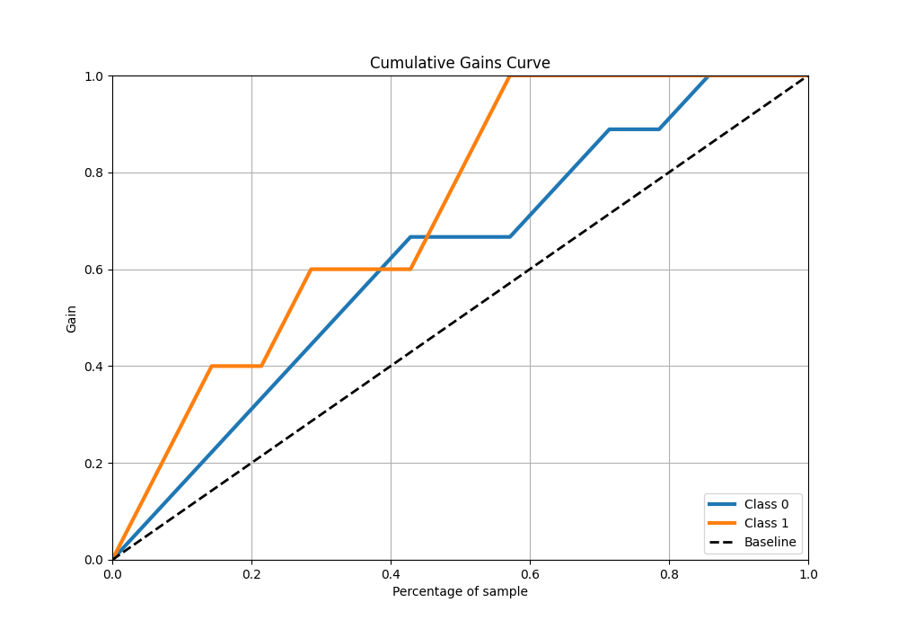
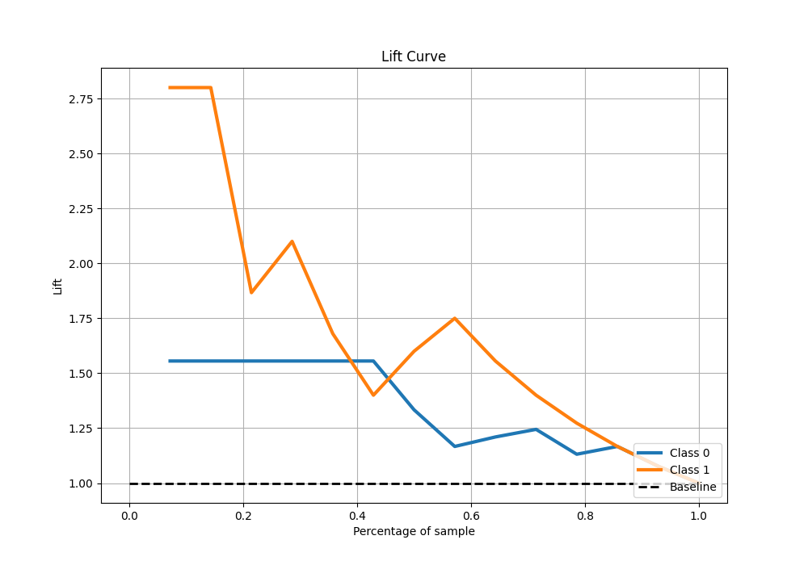

# Summary of Ensemble

[<< Go back](../README.md)

## Ensemble structure
| Model             |   Weight |
|:------------------|---------:|
| 1_Baseline        |        1 |
| 4_Default_Xgboost |        5 |

## Metric details
|           |    score |   threshold |
|:----------|---------:|------------:|
| logloss   | 0.508274 | nan         |
| auc       | 0.844444 | nan         |
| f1        | 0.666667 |   0.131913  |
| accuracy  | 0.785714 |   0.212172  |
| precision | 1        |   0.399488  |
| recall    | 1        |   0.0881909 |
| mcc       | 0.547723 |   0.399488  |

## Metric details with threshold from accuracy metric
|           |    score |   threshold |
|:----------|---------:|------------:|
| logloss   | 0.508274 |  nan        |
| auc       | 0.844444 |  nan        |
| f1        | 0.666667 |    0.212172 |
| accuracy  | 0.785714 |    0.212172 |
| precision | 0.75     |    0.212172 |
| recall    | 0.6      |    0.212172 |
| mcc       | 0.518545 |    0.212172 |

## Confusion matrix (at threshold=0.212172)
|              |   Predicted as 0 |   Predicted as 1 |
|:-------------|-----------------:|-----------------:|
| Labeled as 0 |                8 |                1 |
| Labeled as 1 |                2 |                3 |

## Learning curves

## Confusion Matrix

## Normalized Confusion Matrix

## ROC Curve

## Kolmogorov-Smirnov Statistic

## Precision-Recall Curve

## Calibration Curve

## Cumulative Gains Curve

## Lift Curve

[<< Go back](../README.md)
