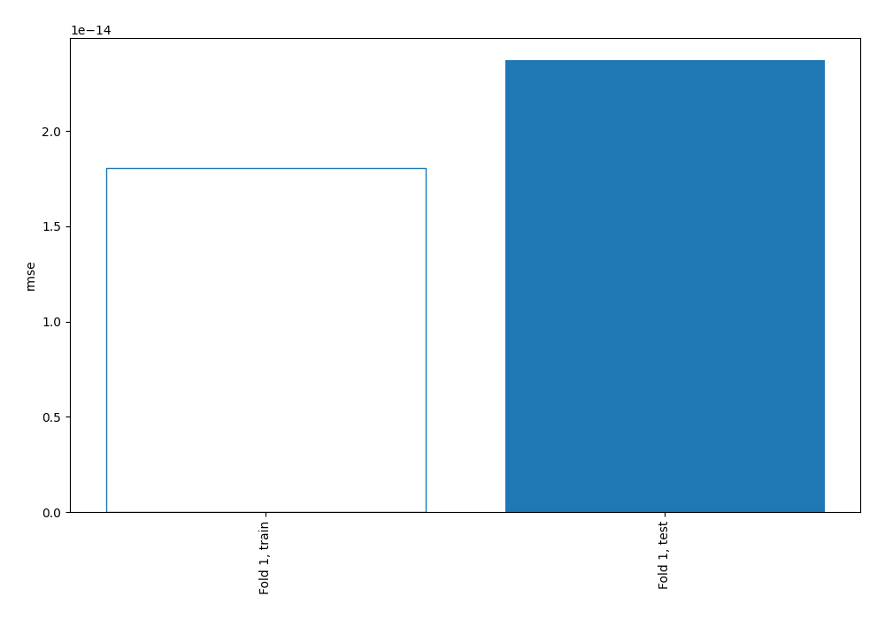
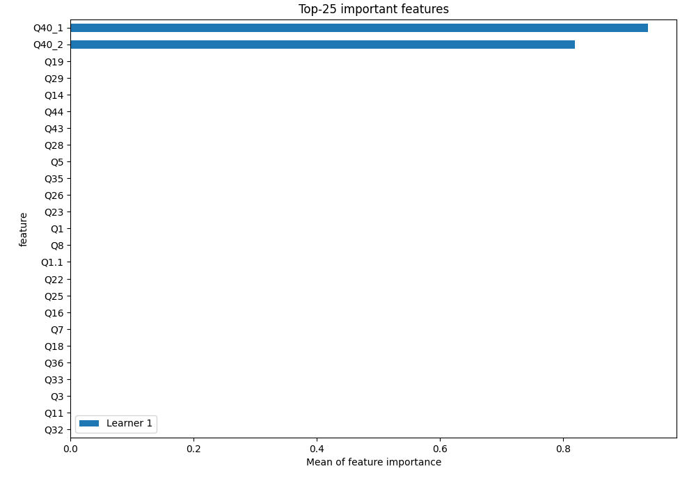
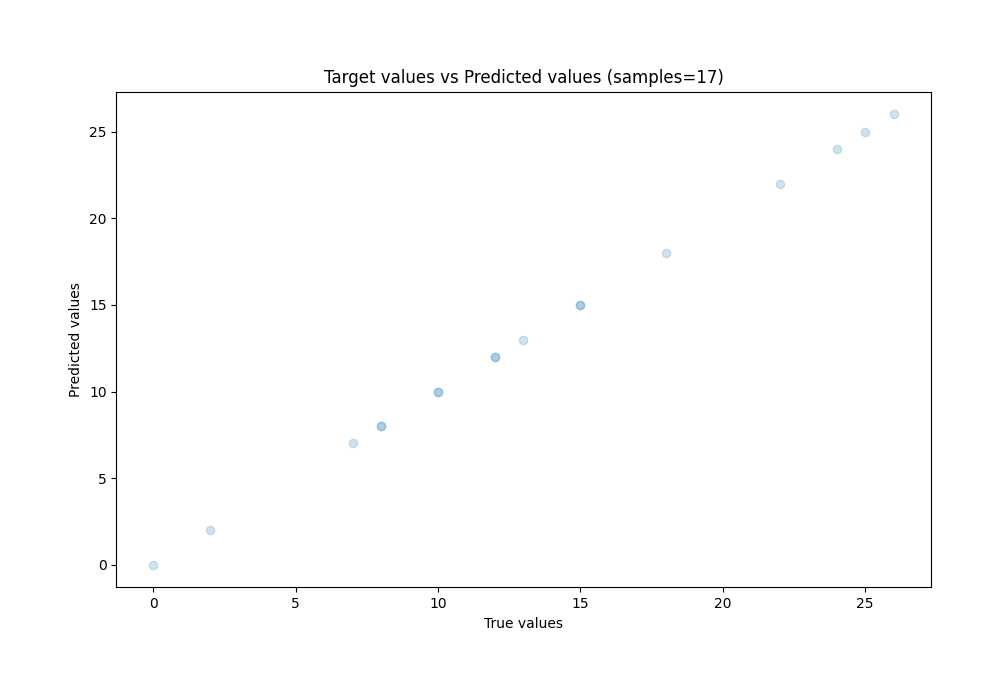
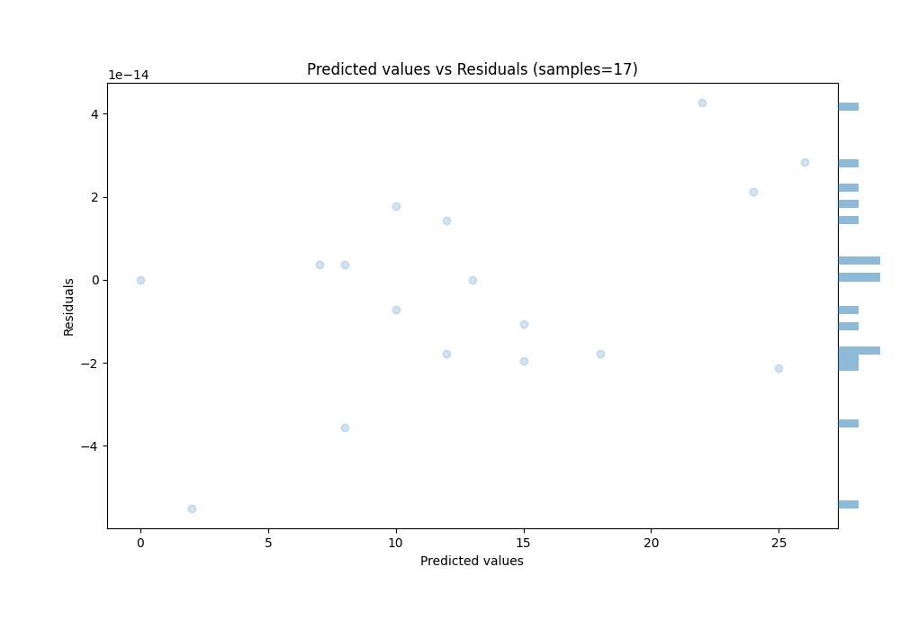
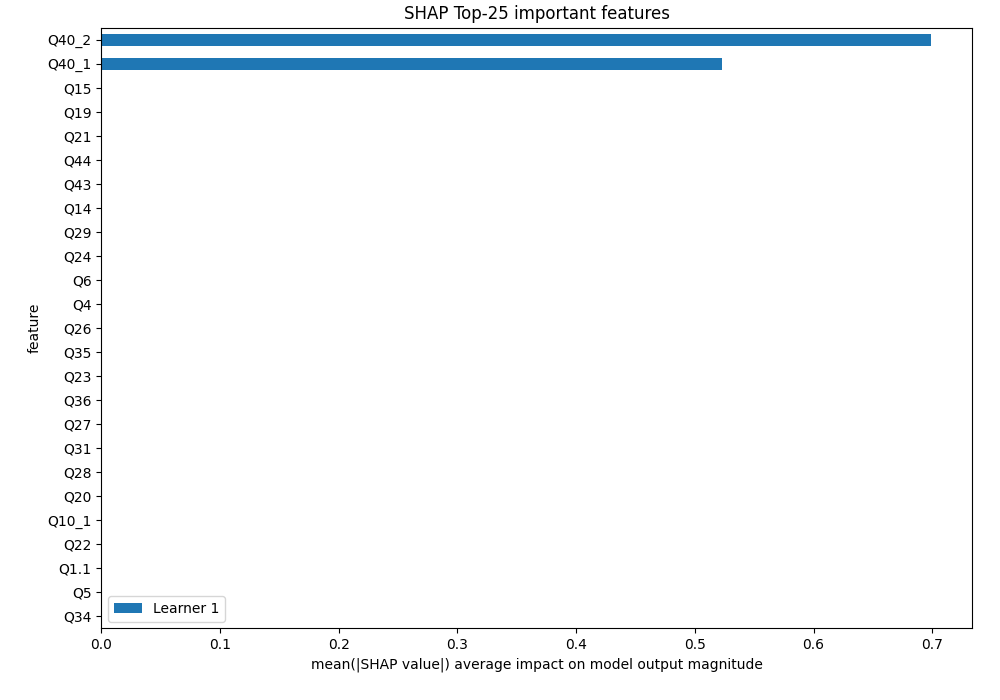
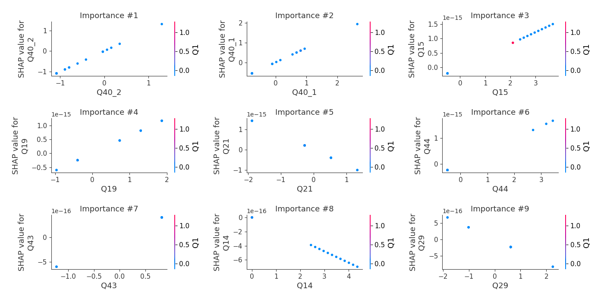
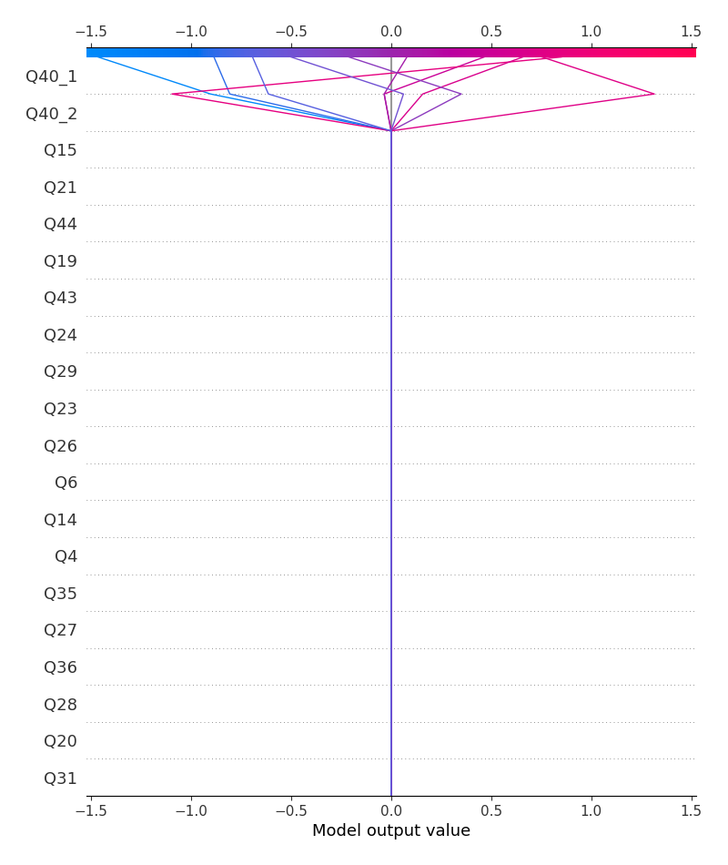
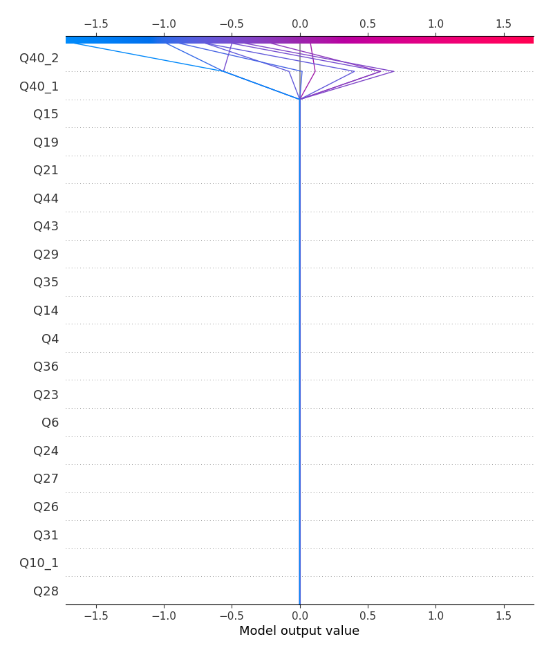

# Summary of 3_Linear

[<< Go back](../README.md)

## Linear Regression (Linear)
- **n_jobs**: -1
- **explain_level**: 2

## Validation
 - **validation_type**: split
 - **train_ratio**: 0.75
 - **shuffle**: True

## Optimized metric
rmse

## Training time

2.6 seconds

### Metric details:
| Metric   |       Score |
|:---------|------------:|
| MAE      | 1.85995e-14 |
| MSE      | 5.61669e-28 |
| RMSE     | 2.36996e-14 |
| R2       | 1           |
| MAPE     | 2.69702e-15 |

## Learning curves

## Coefficients
| feature   |    Learner_1 |
|:----------|-------------:|
| Q40_2     |  1.01312     |
| Q40_1     |  0.733763    |
| Q19       |  6.25614e-16 |
| Q44       |  4.8932e-16  |
| Q43       |  4.87718e-16 |
| Q26       |  4.70415e-16 |
| Q36       |  4.56033e-16 |
| Q4        |  4.0872e-16  |
| Q15       |  4.06793e-16 |
| Q6        |  3.59218e-16 |
| Q24       |  3.48462e-16 |
| Q22       |  3.01228e-16 |
| Q31       |  2.61884e-16 |
| Q5        |  2.39917e-16 |
| Q20       |  2.12008e-16 |
| Q8        |  1.75688e-16 |
| Q11       |  1.68819e-16 |
| Q10_2     |  9.91648e-17 |
| Q32       |  2.52842e-17 |
| intercept |  2.69021e-18 |
| Q33       |  0           |
| Q25       | -8.90374e-18 |
| Q18       | -1.81966e-17 |
| Q3        | -2.50285e-17 |
| Q30       | -4.2601e-17  |
| Q7        | -6.89232e-17 |
| Q10_3     | -7.11239e-17 |
| Q16       | -1.01481e-16 |
| Q9        | -1.09707e-16 |
| Q1        | -1.41922e-16 |
| Q14       | -1.59663e-16 |
| Q34       | -1.96457e-16 |
| Q28       | -1.96562e-16 |
| Q10_1     | -2.07e-16    |
| Q1.1      | -2.35922e-16 |
| Q27       | -2.87145e-16 |
| Q29       | -3.69022e-16 |
| Q23       | -3.84615e-16 |
| Q35       | -3.92048e-16 |
| Q21       | -7.55302e-16 |

## Permutation-based Importance

## True vs Predicted

## Predicted vs Residuals

## SHAP Importance

## SHAP Dependence plots

### Dependence (Fold 1)

## SHAP Decision plots

### Top-10 Worst decisions (Fold 1)

### Top-10 Best decisions (Fold 1)

[<< Go back](../README.md)
