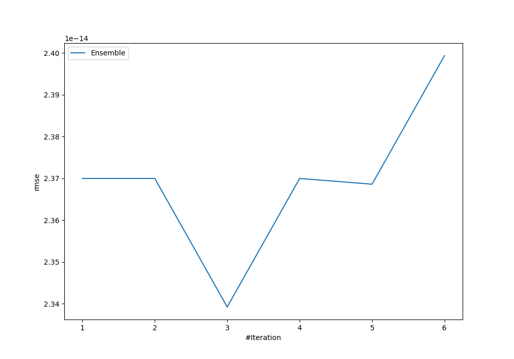
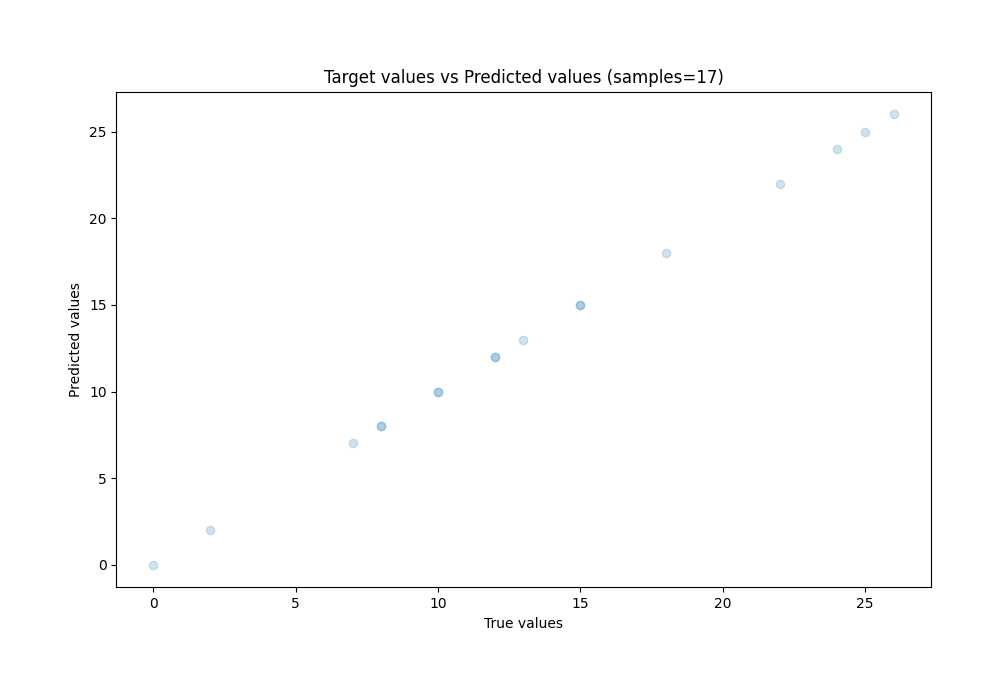
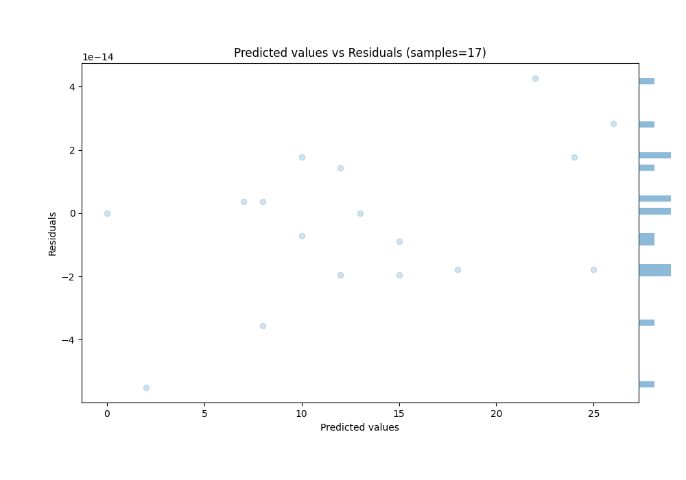

# Summary of Ensemble

[<< Go back](../README.md)

## Ensemble structure
| Model    |   Weight |
|:---------|---------:|
| 3_Linear |        3 |

### Metric details:
| Metric   |       Score |
|:---------|------------:|
| MAE      | 1.81815e-14 |
| MSE      | 5.47191e-28 |
| RMSE     | 2.33921e-14 |
| R2       | 1           |
| MAPE     | 2.6817e-15  |

## Learning curves

## True vs Predicted

## Predicted vs Residuals

[<< Go back](../README.md)
